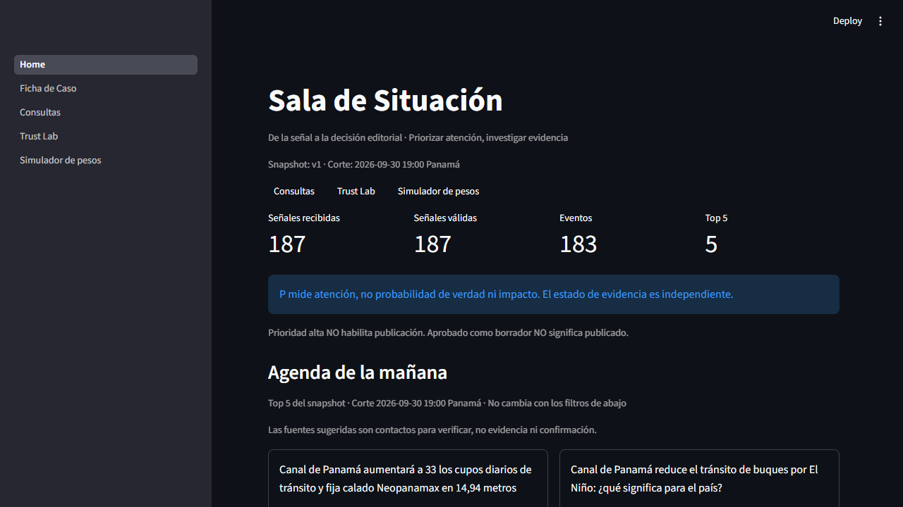

# SCAYL — Sala de Inteligencia Editorial

[](https://github.com/Silentarcherjr/scayl-sala-de-inteligencia-editorial/actions/workflows/ci.yml)

Prototipo para el reto **TVN Media · "De la señal a la decisión"** (hackIAthon Panamá, modalidad editorial).

SCAYL convierte un snapshot congelado de señales públicas en **eventos priorizados**. Cada evento trae su
**evidencia trazable**, sus **vacíos de investigación** y un **borrador editorial citado**, listo para la
revisión humana. **La IA no decide qué es verdad ni qué se publica**: "aprobado como borrador" no significa publicado.



## Qué hace
| Etapa | Cómo | Dónde verlo |
|---|---|---|
| Señal → evento | Validación del snapshot y agrupación semántica con E5 multilingüe local (187 señales → 165 eventos) | Sala de Situación |
| Prioridad | `P = 30R + 25I + 20U + 15N + 10E` (`scoring-v1`), con cada componente y su regla visibles | Ficha · Evento, Simulador |
| Evidencia | Estado de evidencia **separado** de la prioridad. **Source DNA** cuenta procedencias, no titulares. Fuentes oficiales: ACP, INEC, USGS y World Bank | Ficha · Fuentes, Evidencia |
| Tiempo | **Temporal Guard**: todo dato lleva su fecha; lo histórico nunca se presenta como actual | Ficha, Consultas |
| Conflictos | Las cifras incompatibles se muestran juntas, sin elegir ni promediar (ej.: titular 4.7 / USGS 4.5) | Ficha · Evidencia |
| Investigación | Qué se sabe, qué se afirma, qué falta y a quién verificar | Ficha · Vacíos |
| Producción | Borrador con LLM local (qwen3:8b). Cada frase etiquetada HECHO/DECLARACIÓN y con `evidence_id`; validadores por código eliminan cifras sin respaldo, presentes falsos e inyecciones | Ficha · Producir |
| Consultas | Respuestas solo con evidencia del corpus, citadas; **abstención explícita** si falta evidencia | Consultas (modo jurado) |
| Revisión | Estados con transiciones guardadas, justificación obligatoria y recibo con hash | Ficha · Revisión |
| Confianza | Métricas medidas con num/den y "no medido" donde no se midió | Trust Lab |

## Resultados medidos (detalle en `eval/results/` y `docs/notion_mirror/06_TESTS_AND_METRICS.md`)
| Métrica | Resultado | Alcance |
|---|---|---|
| Cobertura de citas del borrador | **45/45** | Top 15 con qwen3:8b; las frases sin cita las elimina el validador |
| Validez de sustento (revisión humana) | **25/30 = 83%** | Los 5 casos fallidos son titulares citados textualmente pero poco relevantes o en otro idioma (DL-031) |
| Abstención correcta (red-team de desarrollo) | **16/16**; abstención incorrecta 0/4 | Set sintético; antes de las correcciones era 6/16 (DL-027) |
| Set reservado escrito por un humano | 6/6 trampas con abstención | Los 4 "controles" de cultura general no están en el corpus: SCAYL no responde de memoria (DL-030) |
| Temas (macro-F1, 100 etiquetas humanas) | Reglas **0,76** · E5 0,25 | Por eso los temas usan reglas (DL-029) |
| Agrupación (F1, pares revisados por humano) | E5 **0,99** · TF-IDF 0,44 | Pares de desarrollo usados para calibrar: resultado optimista |
| Precision@5 frente al top 5 del editor | 1/5 (exploratoria) | El editor vio antes una propuesta de IA (DL-024) |
| Latencia del borrador | Mediana **13,1 s**, p95 17,0 s (n = 15) | AMD RX 9060 XT 8 GB, Ollama Vulkan |
| Costo de API | **$0** | Inferencia 100% local |
| Pruebas | T01–T10 y 188 pruebas en CI | `python -m pytest -q` |

Lo que no medimos queda escrito como **"no medido"**: no afirmamos ahorro de tiempo sin el mini-estudio.

## Probarlo
**Demo sin internet (recomendado, sin GPU ni compilación):**
```bash
python -m venv .venv && source .venv/bin/activate   # Windows: .venv\Scripts\activate
pip install -r requirements.txt
python scripts/demo_offline.py                       # http://localhost:8501
```
Usa el bundle público y las salidas precalculadas de `deploy/artifacts/v1`, sin descripciones RSS.

**Pipeline completo desde el snapshot:**
```bash
python -m scayl.pipeline build --snapshot data/raw/v1            # modo template, sin modelo
pip install -r requirements-ai.txt                                # E5 + cliente Ollama (opcional)
python -m scayl.pipeline build --snapshot data/raw/v1 --llm live  # requiere Ollama con qwen3:8b
python -m pytest -q && ruff check .
```

**Enlace del jurado:** https://scayl-demo.streamlit.app/ (Streamlit Community Cloud, modo cache, acceso abierto sin contraseña). Recomendado: empezar por **Consultas → Modo jurado**, cuyas preguntas tienen respuestas de IA precalculadas. Despliegue en `deploy/README.md`.

## Datos (snapshot `data/raw/v1`, manifest con SHA-256)
- **Noticias:** GDELT (metadatos) y RSS de TVN, del 2025-10-02 al 2026-09-30 (aclaración oficial C-01). Solo titulares y metadatos.
- **Indicadores:** World Bank 2010–2024 (contexto histórico); ACP, nivel diario del lago Gatún; INEC, IPC mensual.
- **Sismos:** USGS.

Licencias y procedencia en `docs/notion_mirror/03_DATA_CATALOG.md`.

## Límites conocidos
- Solo titulares y metadatos: ningún evento real llega a "suficiente para borrador", porque ningún titular cita una cifra oficial comparable. Es abstención correcta, no un error.
- La independencia entre medios casi nunca es demostrable con metadatos; Source DNA lo declara.
- Batch sobre un snapshot congelado, no tiempo real.
- Las etiquetas humanas son pocas (n = 100 temas, 30 afirmaciones, top 5): las métricas son exploratorias.

## Documentación
| Documento | Para qué |
|---|---|
| `docs/DEMO_SCRIPT.md` | Guion del video de demo |
| `docs/ARCHITECTURE.md` | Arquitectura y contratos |
| `docs/notion_mirror/` | Espejo de las páginas de Notion: decisiones (02), métricas y fallos corregidos (06), pitch (08) |
| `docs/PLAN_REVIEW.md` | Revisión del reto, matriz de rúbrica y riesgos |
| `docs/AI_TOOLS_USED.md` | Bitácora de herramientas de IA usadas en el desarrollo |
| `AGENTS.md`, `CLAUDE.md`, `docs/TASKS.md` | Cómo trabajó el equipo humano + agentes |

Equipo SCAYL: Silentarcherjr, frictionspp-svg y LowCrime, con agentes de código (Claude Code y Codex) bajo revisión humana.
